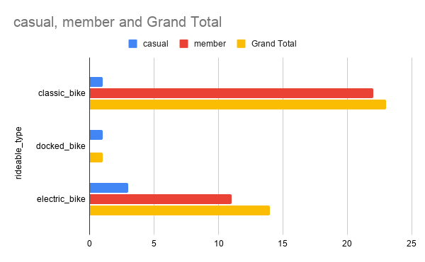

# cyclistic-bike-share-analysis
## Overview
This project analyzes how casual riders and annual members use Cyclistic bikes differently. The goal is to identify behavioral patterns and provide data-driven recommendations to convert casual riders into annual members.

---

## Business Task
Understand the key differences between casual riders and annual members to support marketing strategies aimed at increasing memberships.

---

## Tools Used
- Google Sheets
- Microsoft Excel
- Pivot Tables
- Data Visualization

---

## Data Cleaning & Preparation
- Combined multiple monthly CSV files into a single dataset
- Removed inconsistencies and ensured data accuracy
- Created new variables:
  - Ride Length (duration of each trip in minutes)
  - Day of Week (to analyze usage patterns)

---

## Key Findings

### Ride Duration
- Casual riders average ~34 minutes per ride
- Annual members average ~14 minutes per ride
- Casual riders use bikes more for leisure, while members use them for commuting

### Ride Frequency
- Members ride consistently during weekdays
- Casual riders ride more frequently on weekends
- Indicates commuting vs recreational usage patterns

---

## Visualizations

### Average Ride Length: Members vs Casual Riders

### Ride Frequency by Day of Week

### Bike Type Usage by Rider Type

---

## Recommendations
1. Target casual riders with weekend membership promotions  
2. Promote membership benefits for daily commuters  
3. Offer trial memberships or discounts to frequent casual riders  

---

## Files Included
- Cyclistic Bike Share Case Study (PDF)
- Processed dataset (Excel)
